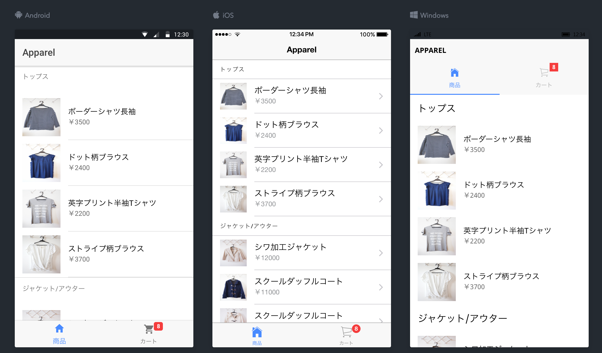
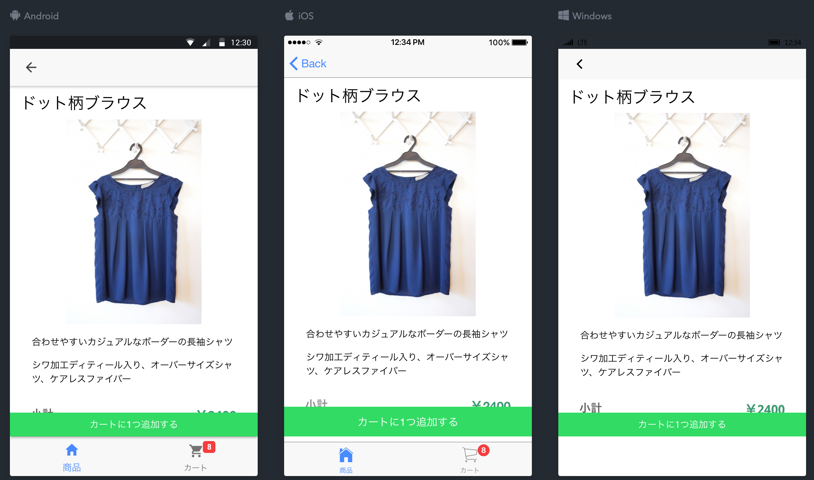
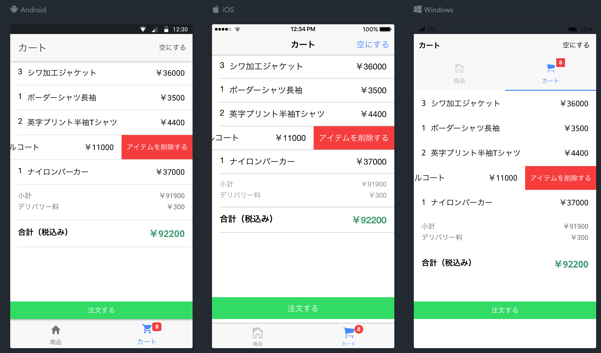

# Ionic Shopping Application([Try It](https://l08084.github.io/ionic-sample-shopping-app/www))

## Getting Started

* [Download the installer](https://nodejs.org/) for Node.js 6 or greater.
* Install the ionic CLI globally: `npm install -g ionic`
* Clone this repository: `git clone https://github.com/l08084/ionic-sample-shopping-app`.
* Run `npm install` from the project root.
* Run `ionic serve` in a terminal from the project root.

_Note: You may need to add “sudo” in front of any global commands to install the utilities._

## App Preview

[Try it live](https://l08084.github.io/ionic-sample-shopping-app/www)

* Home Page

  

* Detail Page

  

* Cart Page

  
